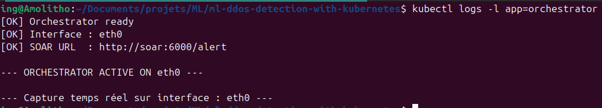
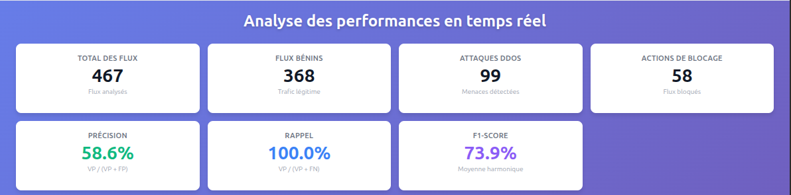
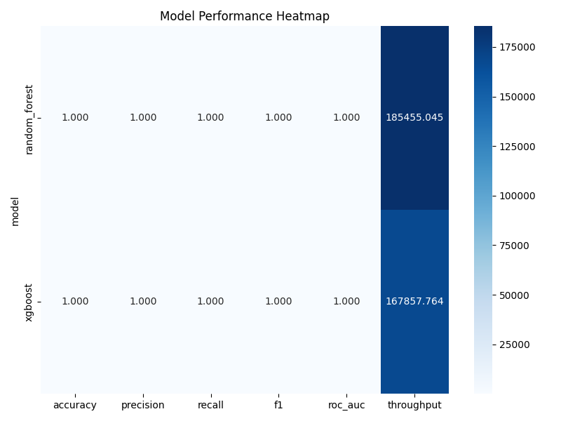

# ML-based DDoS Detection with Kubernetes & SOAR

Projet complet de **détection et réponse automatique aux attaques DDoS**, basé sur le **Machine Learning**, déployé sur **Kubernetes**, avec un composant **SOAR** pour la décision et l’action en temps réel.

Ce projet couvre **toute la chaîne** :
- collecte du trafic réseau
- preprocessing et entraînement ML
- inférence temps réel
- orchestration et réponse automatique
- visualisation et traçabilité

---

## Prérequis

Créer les fichiers nécessaires et adaptez les : .env et k8s/base/secret.yaml
Pour ce faire, lancer le script prerequis.sh

```bash
chmod +x prerequis.sh
./prerequis.sh
```

Ces fichiers seront automatiquement créez, il faudra juste adapter ces contenus.

## Démonstration visuelle (captures)

### Architecture cible


### Orchestrateur & flux SOAR


### Dashboard temps réel


### Performances des modèles (en production)


### Heatmap modèles (sur données de test)



## Objectifs du projet

- Détecter automatiquement des attaques DDoS à partir du trafic réseau
- Utiliser des modèles ML robustes et généralisables
- Déployer une architecture réaliste orientée microservices
- Mettre en place une réponse automatique (blocage + alertes)
- Fournir une traçabilité complète pour analyse et audit

---

## Architecture générale

- Capture réseau temps réel
- Reverse proxy Nginx
- Inférence ML
- SOAR (décision + action)
- Base de données MySQL
- Dashboard web
- Déploiement Kubernetes avec Kustomize

Documentation détaillée :  
📄 [`docs/architecture.md`](docs/architecture.md)

---

## Pipeline Machine Learning

1. Préparation et fusion des datasets
2. Équilibrage binaire (Benign vs DDoS)
3. Preprocessing reproductible
4. Entraînement multi-modèles
5. Tuning optionnel
6. Sauvegarde des modèles

Documentation :  
📄 [`docs/ml_pipeline.md`](docs/ml_pipeline.md)

Scripts clés :
- [`run_pipeline_ML.sh`](run_pipeline_ML.sh)
- [`preprocessed_data/`](preprocessed_data/)
- [`train/`](train/)
- [`tuning/`](tuning/)

---

## Détection & inférence temps réel

- Application du même pipeline de preprocessing
- Chargement des modèles entraînés
- Prédictions avec probabilités
- Seuils configurables

Documentation :  
📄 [`docs/inference.md`](docs/inference.md)

---

## SOAR — Réponse automatique

Le composant SOAR :
- reçoit les prédictions
- applique des règles de décision
- déclenche des actions (blocage / autorisation)
- envoie des alertes Telegram
- gère une whitelist

Documentation :  
📄 [`docs/soar.md`](docs/soar.md)

Tests :
- [`test_soar_scenarios.sh`](test_soar_scenarios.sh)

---

## Base de données & traçabilité

- Historique complet des flux analysés
- Décisions et actions associées
- Support dashboard et audit

Documentation :  
📄 [`docs/database.md`](docs/database.md)

---

## Kubernetes & déploiement

- Manifests Kubernetes
- Kustomize (base / dev / prod)
- Services, pods, secrets, configmaps
- Déploiement automatisé

Documentation :  
📄 [`docs/kubernetes.md`](docs/kubernetes.md)

Scripts :
- [`run_system_k8s.sh`](run_system_k8s.sh)
- [`docker-compose.yml`](docker-compose.yml)

---

## Évaluation & performances

- Benchmarks multi-modèles
- Métriques ML classiques
- Dashboards de performance
- Visualisations graphiques

Documentation :  
📄 [`docs/evaluation.md`](docs/evaluation.md)

---

## Structure du projet

La documentation complète est centralisée ici :  
📁 [`docs/`](docs/)

Chaque sous-composant dispose de son propre `README.md`.

## Lancer le projet

Juste executer les scripts suivants

```bash
./install_kubernetes_env.sh # Installer l'environnement minikube
./run_system_k8s.sh # Démarre tout
```

## Arreter le projet

ctrl + c && executer le script

```bash
./delete_images_pods_svc.sh # Supprimer les images, les pods, les services, minikube, etc.
```

---

## Public cible

- Étudiants et chercheurs
- Ingénieurs sécurité
- Ingénieurs Machine Learning
- DevOps / SRE
- Évaluateurs académiques

---

## Perspectives

- Détection multi-classes des attaques
- Ajout de modèles deep learning
- Extension SOAR (firewall externe, SIEM)
- Apprentissage en ligne
- Support multi-clusters Kubernetes

---

## Licence

Projet distribué sous licence MIT.  
Voir [`LICENSE`](LICENSE).
