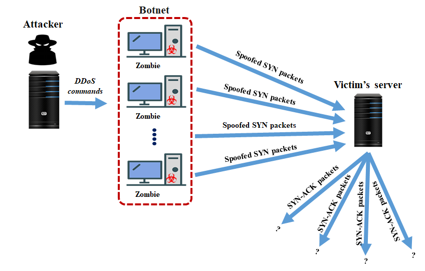

# Système distribué de détection d'attaque DDoS via machine learning 

Ce projet vise à combiner **Machine Learning** et **infrastructure cloud-native** (Docker, Kubernetes) pour offrir une solution efficace de **détection et mitigation automatique d’attaques DDoS**.

## Sommaire
1. [Introduction](#1-introduction)  
2. [Problématique](#2-problématique)  
3. [Objectif](#3-objectif)  
4. [Solution proposée](#4-solution-proposée)  
5. [Architecture cible](#5-architecture-cible)  
6. [Méthodologie](#6-méthodologie)  
7. [Outils et technologies utilisées](#7-outils-et-technologies-utilisées)  
8. [Évaluation et tests](#8-évaluation-et-tests)  
9. [Documentation et traçabilité](#9-documentation-et-traçabilité)  
11. [Prochaines étapes](#10-prochaines-étapes)  
12. [Auteurs](#11-auteurs)  
13. [Licence](#12-licence)
14. [Références](#13-références)

------

## 1. Introduction

Une **attaque DDoS** (Distributed Denial of Service) consiste à inonder un service de requêtes pour en perturber la disponibilité.  Ce type d’attaque vise à rendre un site ou une application inutilisable en surchargeant son infrastructure réseau.

**Il y a plusieurs types :**

**Exemple d'une attaque DDoS SYN flood [[0]](#ref0):** 

Le **Machine Learning (ML)** — *“the science (and art) of programming computers so they can learn from data”[[1]](#ref1)* — peut être appliqué pour détecter automatiquement ces comportements anormaux dans le trafic réseau.

---

## 2. Problématique

Lors d’une attaque DDoS, des millions de requêtes sont envoyées chaque seconde. Un simple modèle de ML risque d’avoir un **temps d’inférence trop élevé**, entraînant une saturation du système.

Par exemple, Cloudflare a subi une attaque DDoS atteignant **11.5 Tbps** (environ **5.1 milliards de requêtes par seconde**) [[2]](#ref2).  

**Comment réduire ce temps d’inférence et permettre au modèle d’analyser efficacement un grand volume de trafic en temps réel ?**

---

## 3. Objectif

Développer une solution basée sur le Machine Learning capable de détecter des attaques DDoS en temps réel,  tout en maintenant un **temps d’inférence faible** grâce au **déploiement parallèle du modèle** sur plusieurs instances.

## 4. Solution proposée

- Déployer plusieurs instances du même modèle ML via **Docker** pour exploiter le **parallélisme**.  
- Utiliser **Kubernetes (k8s)** pour :
  - Gérer automatiquement la répartition de charge entre les instances.  
  - Mettre à l’échelle horizontalement en cas de forte charge.  
- Stocker les inférences positives (attaques détectées) dans une base de données.  
- Bloquer dynamiquement la source malveillante (adresse IP) et envoyer une alerte par e-mail et Telegram.

---

## 5. Architecture cible

- Le trafic réseau est analysé par les modèles déployés dans des conteneurs Docker.  
- Kubernetes gère la scalabilité et la tolérance aux pannes.  
- Les résultats sont stockés et les attaques bloquées dynamiquement.
- Une interface web affiche les métriques importantes et des logs réseaux

---

## 6. Méthodologie

1. **Revue de littérature** pour le choix du modèle ML le plus performant.  
2. **Implémentation du pipeline** d’entraînement et d’inférence du modèle.  
3. **Exposition du modèle via une FastAPI**.  
4. **Création d’un Dockerfile** et **déploiement multi-instance via Docker Compose**.  
5. **Orchestration complète avec Kubernetes**.
6. **Stockage des inférences positives** dans une base de données.  
7. **Création d’une interface web** pour visualiser les informations en temps réel.  
8. **Blocage automatique** des IP malveillantes et notification par **mail / Telegram**.  

---

## 7. Outils et technologies utilisées

- **Python** (Machine Learning, FastAPI)  
- Framework ML : **Scikit-learn**   
- **MySQL** / **Elasticsearch** (stockage des logs et inférences)  
- **Docker & Docker Compose** (conteneurisation et parallélisation)  
- **Kubernetes (k8s)** (orchestration et scaling)  
- **Bot telegram (token, chatID) / SMTP** (alertes en temps réel)

---

## 8. Évaluation et tests

- Test du modèle sur des jeux de données d’attaques DDoS publics (CICDDoS2019).  
- Mesure de la précision, du rappel et du F1-score.  
- Évaluation du **temps d’inférence moyen** par instance.  
- Test de **scalabilité horizontale** sous Kubernetes.  

---

## 9. Documentation et traçabilité

Toutes les étapes seront documentées au fil de l’eau dans ce dépôt :
- Journal d’expériences.  
- Captures d’écran des tests et métriques.  
- Diagrammes d’architecture.  
- Scripts et configurations Docker / K8s.

---

## 10. Prochaines étapes

- Choisir et entraîner le modèle ML.  
- Implémenter le pipeline d’inférence Flask.  
- Créer les conteneurs Docker et les tester localement.  
- Passer au déploiement Kubernetes.  
- Intégrer le système d’alerte et de blocage dynamique.

---

## 11. Auteurs

| **Amolitho Baldé** | GitHub : [@Bamolitho](https://github.com/Bamolitho)     |
| ------------------ | ------------------------------------------------------- |
| **Alexis Goerges** | **GitHub : [@monkeypot](https://github.com/monkeypot)** |

---

## 12. Licence

Ce projet est distribué sous la licence **MIT** — voir le fichier [LICENSE](LICENSE) pour plus de détails.

------

## 13. Références

[<a id="ref0">0</a>] [https://www.infosec.gov.hk/en/knowledge-centre/ddos](https://www.infosec.gov.hk/en/knowledge-centre/ddos)  

[<a id="ref1">1</a>] Aurélien Géron, *Hands-On Machine Learning with Scikit-Learn and TensorFlow* 

[<a id="ref2">2</a>] [https://aardwolfsecurity.com/cloudflare-crush-a-record-breaking-ddos-attack/](https://aardwolfsecurity.com/cloudflare-crush-a-record-breaking-ddos-attack/)